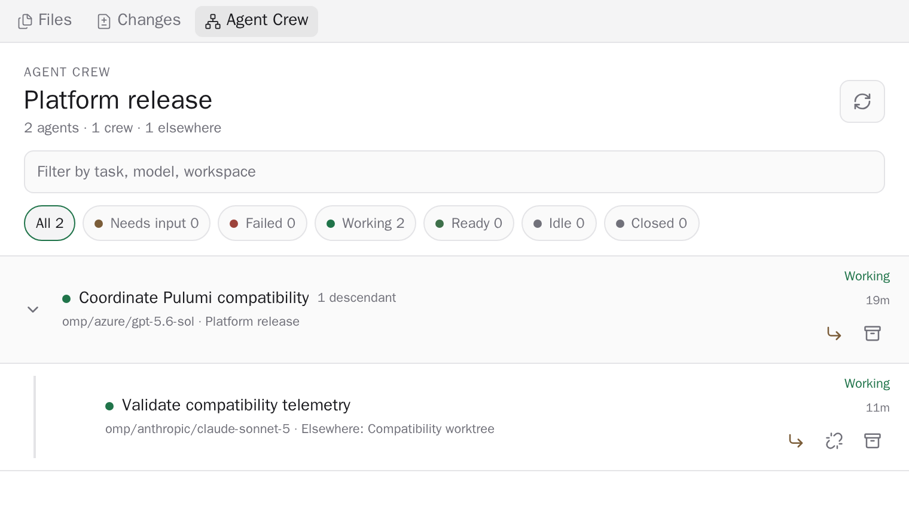

# Agent Crew

See and control every managed Paseo agent working in a workspace. Agent Crew adds a
workspace-context Explorer panel plus an `Open Agent Crew` Command Center item.

It answers "which crews are active here, and which agent needs me now?" while preserving managed
parent-child relationships across workspace boundaries.

## Screenshots

Names, workspaces, and task details in these screenshots are synthetic. The rendered page was
rewritten before capture so no private project or session identifiers are published.

### Crew overview



### Safe action confirmation


## What it shows

- Every non-archived managed agent in the current workspace, organized into orchestration trees.
- Managed descendants remain in their crew when they run in another workspace.
- Out-of-workspace ancestors required to explain a local agent appear as dimmed, open-only context;
  unrelated foreign branches are pruned.
- Independent agents appear as top-level rows, while collapsible tree rails and descendant counts
  distinguish delegated crews.
- Provider and model, workspace, last error, state, and activity age for each visible agent.
- Counts and filters for Needs input, Failed, Working, Ready, Idle, and Closed.
- Text search over title, agent ID, provider, model, working directory, workspace, and labels.
- Live agent and workspace subscriptions, debounced by 500 ms, plus a 30-second backstop refresh.
- Direct navigation to a selected agent when the host provides agent navigation.
- Explicit Allow and Deny controls for visible pending permission requests.

## Controls

Each row exposes the operations available through the public Paseo SDK:

- **Open** navigates to the selected agent.
- **Expand or collapse** shows or hides a managed branch without changing agent state.
- **Nudge** sends a follow-up to an idle or waiting agent.
- **Interrupt and redirect** sends a new direction to a running agent. Paseo stops the active turn
  before starting that direction, and the confirmation dialog says so explicitly.
- **Detach** removes a managed child branch from its parent while allowing it to continue
  independently. Root agents and context-only ancestors do not expose this action.
- **Archive** stops and removes the selected agent. Same-workspace descendants may be archived with
  it; cross-workspace descendants may detach and continue. The confirmation dialog describes that
  behavior before the action runs.
- **Permission allow / deny** opens one explicit request modal for the selected pending request and
  answers it with `request.id`; no automatic approval policy runs.

Every mutating control uses a confirmation dialog. Successful actions show a toast; SDK errors are
shown without hiding the failure.

## How it reads state

`usePaseo().agents.list()` and `usePaseo().workspaces.list()` page the selected daemon directory at
200 entries per page, up to 10 pages. Parent relationships come from the first-class
`parentAgentId` field when the public 0.8 SDK exposes it, with a legacy label fallback for older
snapshots. The workspace crew contains local agents, their managed descendants, and only the foreign
ancestor paths needed to explain local membership. Archived agents are omitted, malformed parent
cycles are bounded, and siblings are ordered by actionable state, creation time, then ID.

State precedence is:

1. Failed
2. Needs input
3. Working
4. Ready
5. Closed
6. Idle

Failed takes precedence over pending permission state so an errored agent is never presented as an
agent that can resume normally.

## Limits

Agent Crew intentionally stays inside the public Paseo plugin SDK.

- It shows managed Paseo agents only. Native provider subagents are not exposed by the public plugin
  SDK.
- Workspace-less top-level agents are outside every workspace crew; workspace-less descendants of
  visible members remain in that crew.
- It does not add heartbeat controls, private cancellation calls, or direct daemon API access.
- Sending to a running agent interrupts its active turn; there is no separate non-interrupting send
  operation.
- If the daemon contains more than 2,000 agents, the panel warns that its directory snapshot may
  omit agents in this workspace or their descendants.

## Install

Paseo plugins are trusted, unsandboxed code. Review the source before installing it.

From GitHub:

```bash
paseo plugin add omercnet/paseo-plugins:agent-crew
```

From a local checkout on the Paseo daemon host:

```bash
git clone https://github.com/omercnet/paseo-plugins.git
cd paseo-plugins/agent-crew
bun install --frozen-lockfile
paseo plugin install "$PWD"
```

Open a workspace, choose **New tab** in Explorer, then select **Agent Crew**. The **Open Agent Crew**
Command Center action opens it directly.

## Develop

```bash
bun install
bun run check
bun test
bun run test:coverage
bun run typecheck
paseo plugin install /absolute/path/to/paseo-agent-crew
paseo plugin reload agent-crew
```

The manifest requires Paseo `^0.8.0`, which accepts Paseo 0.8.x including compatible prereleases.
The project pins `@getpaseo/cli`, `@getpaseo/client`, `@getpaseo/plugin`, and
`@getpaseo/protocol` to `0.8.0-beta.1`. React 19.1 and React Native 0.81 match the host.

Release Please maintains versions, changelog entries, component tags, and GitHub releases from
Conventional Commits in the monorepo.
