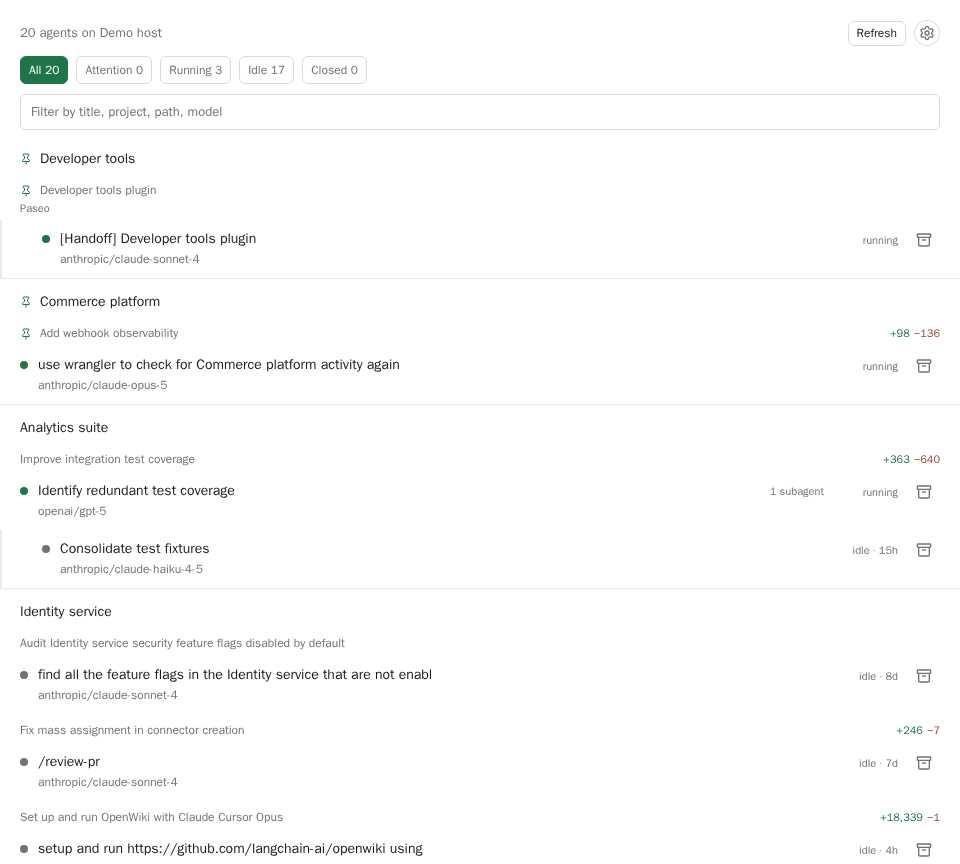
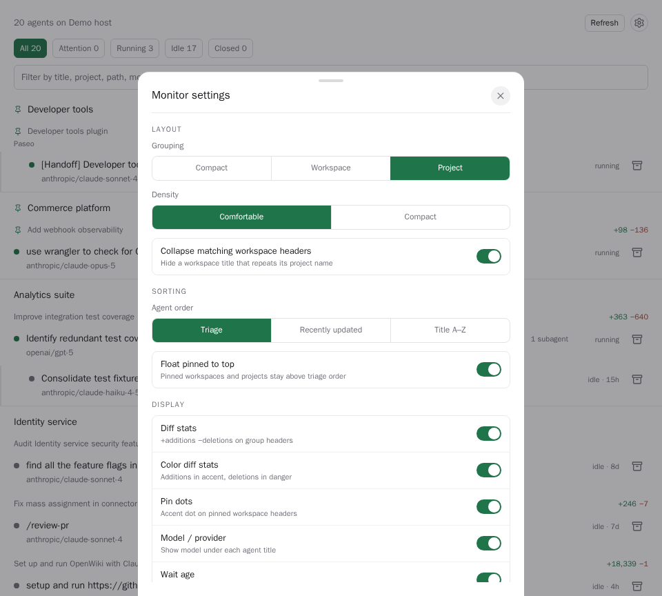

# agent-monitor

One roster for every agent on a daemon. Sidebar surface (`Agent monitor`) plus a global Command
Center item (`Open agent monitor`).

Answers "which of my 38 agents needs me right now" without walking the workspace tree.

## Screenshots

Names and session titles in these screenshots are synthetic; the underlying browser DOM was
rewritten before capture so no private project, workspace, or session identifiers are published.

### Project-first roster



### Monitor settings



## What it shows

- Counts and filters by triage bucket: Attention, Running, Idle, Closed. Attention covers
  `requiresAttention`, `status === "error"`, and pending permission requests.
- Default layout groups agents by **project**, then by workspace under each project. Open the
  gear beside Refresh for the host-native Monitor settings screen, which can switch to workspace
  groups or a flat compact list.
- Settings also control float-pinned sorting, agent sort (triage / recently updated / title),
  collapse of matching workspace headers, density, default bucket, whether Closed stays out of
  All, and display toggles for diffs, pin markers, model, wait age, subagent counts, last error, and
  compact placement. Preferences are a typed, host-scoped document shared by connected clients.
- Workspace headers show up to two workspace labels and current `+additions −deletions`
  (additions in the success color, deletions in danger when color diffs are on).
- Per row: a status dot that separates errors (danger) from agents waiting on you (warning) and
  running agents (success), state and wait age on a right-aligned rail (`attentionTimestamp`,
  falling back to `updatedAt`), model, and `lastError` inline.
- Parent rows show their subagent count; child rows use a left indent guide.
- Text filter over title, agent id, provider, model, cwd, project, and workspace.
- Select an agent row to open that agent, or select a workspace header (or its folder button when
  collapsed) to open its workspace through Paseo's cross-platform navigation API.
- Archive one agent, or sweep every closed agent (two taps).

## How it reads state

`usePaseo().agents.list()` pages the daemon agent directory, `usePaseo().workspaces.list()` reads
workspace pin state, project id, and diff stats (200 per page, up to 10 pages each), and
`usePaseo().projects.list()` supplies registered project names, including custom renames, so an
agent whose workspace is beyond the paged workspace list still lands under its real project. Rows
refresh from agent, workspace, and project subscription deltas, debounced 750ms, with a 30s
backstop refetch. The plugin borrows the selected host's connection; it opens no socket of its own.

## Limits

Interrupting a turn is not part of `PaseoApi`, so archive is the only lifecycle action here.

## Install

Requires a compatible Paseo 0.8.x release, including 0.8 prereleases. The manifest declares
`requirements.paseo` as `^0.8.0`, and the development SDK is pinned to `0.8.0-beta.1`.

Install from the plugin's monorepo directory on the daemon host:

```bash
paseo plugin add omercnet/paseo-plugins:agent-monitor
paseo plugin update agent-monitor
```

Git installs track the default branch and run no package manager; the plugin has no runtime
dependencies. For an air-gapped host, clone or download the monorepo and install this directory:

```bash
cd paseo-plugins/agent-monitor
bun install --frozen-lockfile
paseo plugin install "$PWD"
```

## Develop

```bash
bun install
bun run check
bun test
bun run test:coverage
bun run typecheck
bunx paseo plugin install "$PWD"
bunx paseo plugin reload agent-monitor
```

Release Please maintains the version, changelog, component tag, and GitHub release from
Conventional Commits in the monorepo.

The project targets the Paseo 0.8.x release line and pins `@getpaseo/plugin`, `@getpaseo/client`,
`@getpaseo/protocol`, and `@getpaseo/cli` to `0.8.0-beta.1`. Renovate groups
`@getpaseo/*` updates so the SDKs move together.

React `19.1` and React Native `0.81` intentionally match the versions supplied by Paseo 0.8.
