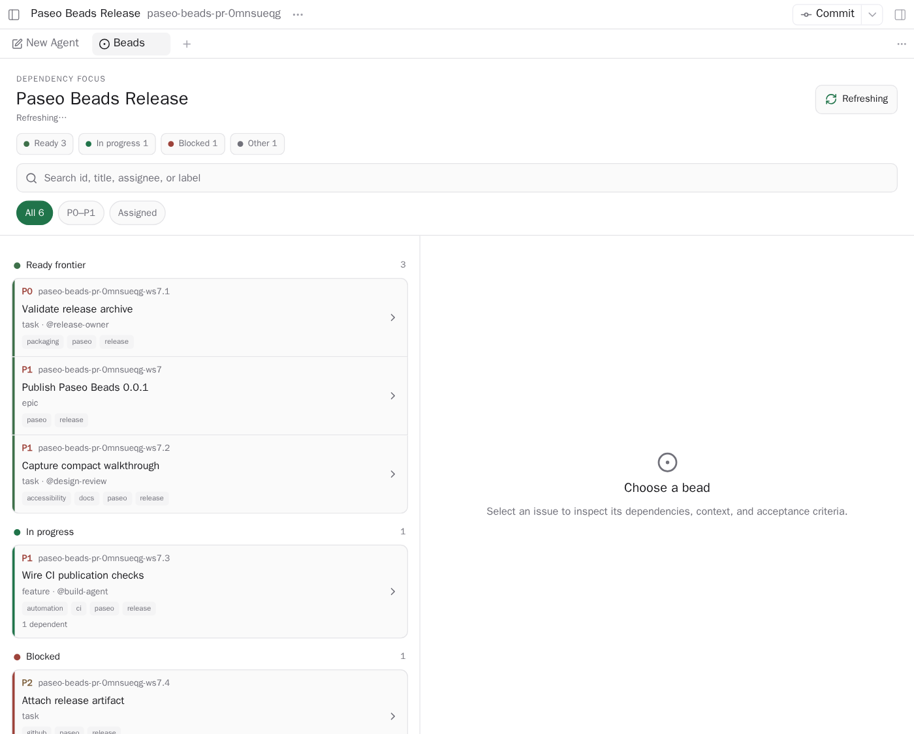
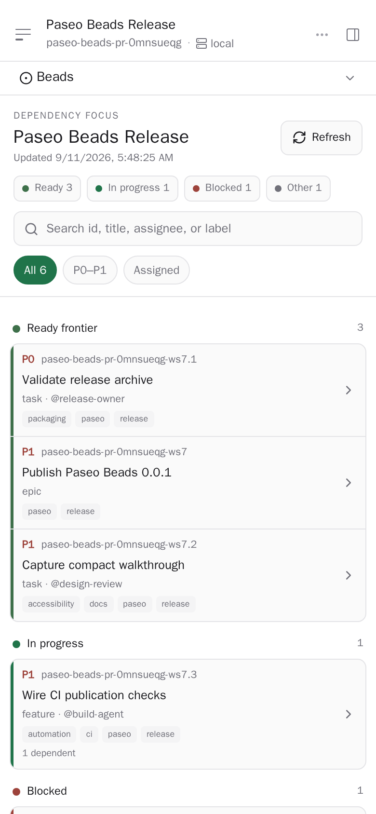

# Paseo Beads

A dependency-aware Beads work queue for every Paseo workspace. Paseo Beads turns active issues into
a read-only delivery view that makes the ready frontier, work in progress, and blockers immediately
visible.

It adds a workspace-scoped **Beads** Explorer panel and an **Open Beads** Command Center item.

## Screenshots

Issue IDs, titles, assignees, labels, and issue details in these screenshots are synthetic. They do
not contain data from a real Beads project.

### Wide



### Compact



## What it shows

- Active issues grouped into **Ready frontier**, **In progress**, **Blocked**, and **Other** lanes.
- Priority, issue ID, title, type, assignee, labels, and relationship and comment counts on each row.
- Lane totals, text search over ID, title, assignee, and labels, and **All**, **P0–P1**, and
  **Assigned** filters.
- A detail view with status, readiness, priority, type, assignee, parent, labels, description,
  acceptance criteria, design, notes, dependencies, dependents, and update time.
- A side-by-side list and detail view when space permits, with list/detail navigation in compact
  layouts.
- A virtualized issue list, descriptive accessibility labels, and focus restoration when navigating
  between the compact list and detail view.

Within each lane, issues are ordered by priority, most recent update, then ID. In-progress and hooked
issues enter **In progress** first; remaining blocked issues enter **Blocked**; ready issues enter
**Ready frontier**; all remaining active issues enter **Other**.

## How it works

The panel calls workspace-scoped Paseo plugin RPC handlers. On the daemon host, each handler resolves
the workspace directory through Paseo and executes the `bd` CLI with `--readonly` and `-C`:

- The list handler runs `bd list --json --sort priority`, then runs one authoritative
  `bd list --ready --json --limit 0` query and intersects its IDs with the displayed issues.
- Selecting an issue runs `bd show <issue-id> --json --include-dependents` plus the same authoritative
  readiness query.

The server validates and normalizes the CLI JSON before returning bounded data to the panel. The
plugin never reads or writes `.beads` storage directly and exposes no issue mutation controls.

The list and selected detail poll every 10 seconds. **Refresh** requests the list immediately. A
failed background refresh keeps the previous data visible with an inline error; initial and detail
failures provide a retry action.

## Limits

- Paseo `^0.8.0` with plugins enabled is required.
- Beads `bd` 1.0 or newer must be available on the Paseo daemon's `PATH`.
- A Beads project must be initialized in the workspace for issue data to appear.
- CLI calls time out after 10 seconds and accept at most 8 MiB of output. Unexpected CLI details stay
  in Paseo plugin logs; the panel receives a stable, sanitized error message.
- At most 500 issues are displayed. When more exist, the panel warns that lane counts and local
  search results may be incomplete.
- The server rejects oversized IDs, titles, body fields, labels, relationships, comments, and
  readiness sets rather than transferring unbounded data to the client.
- Search and filters operate only on the displayed snapshot.
- The panel distinguishes an unavailable `bd` binary, an uninitialized Beads project, an empty
  project, request failures, and missing issue details.
- This plugin is read-only and workspace-scoped. It uses the `bd` CLI exclusively and does not
  create, edit, close, or assign issues.

## Install

Paseo plugins are trusted, unsandboxed code. Review the source before installing it on the daemon
host.

From GitHub:

```bash
paseo plugin add omercnet/paseo-plugins:paseo-beads
```

From a local checkout on the Paseo daemon host:

```bash
git clone https://github.com/omercnet/paseo-plugins.git
cd paseo-plugins/paseo-beads
bun install --frozen-lockfile
paseo plugin install "$PWD"
```

Open a workspace, choose **New tab** in Explorer, then select **Beads**. You can also run **Open
Beads** from the Command Center while viewing a workspace or one of its agents.

## Develop

```bash
bun install
bun run check
bun test
bun run test:coverage
bun run typecheck
paseo plugin install "$PWD"
paseo plugin reload paseo-beads
```

The package is `@omercnet/paseo-beads` at version `0.0.1`. Release Please maintains versions,
changelog entries, component tags, and GitHub releases from Conventional Commits in the monorepo.
