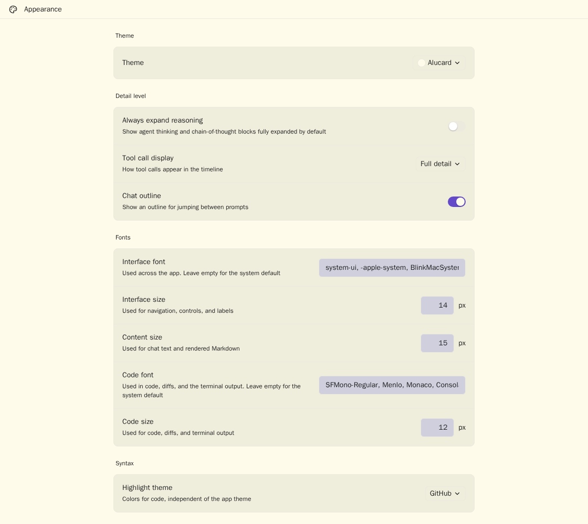

# Dracula for [Paseo](https://paseo.sh)

> Dracula Classic and Alucard Classic app themes for Paseo.




## Install

See [INSTALL.md](./INSTALL.md) for Git installation, activation, updates, removal, and local
development installation.

## Themes

This minimal, data-only plugin contributes both variants defined by the
[official Dracula specification](https://draculatheme.com/spec):

- **Dracula**: the original dark theme.
- **Alucard**: the complementary light theme.

The plugin registers no surfaces, commands, RPCs, filesystem access, process access, or network
behavior.

Paseo expands each contributed seed palette into app surfaces, panels, menus, diffs, status colors,
terminal colors, focus treatment, and shadows. Syntax highlighting is a separate Paseo preference.
For Dracula, select **Dracula** under **Settings → Appearance → Highlight theme** for matching code
colors. For Alucard, use one of Paseo's light-capable syntax themes.

## Requirements and limits

- Requires Paseo 0.8.x, including compatible 0.8 prereleases.
- The plugin contains no daemon-side behavior and does not read or change application state.

## Palette mapping

Every contributed seed is set explicitly from the official Dracula Classic and Alucard Classic
palette or UI palette.

| Paseo seed | Dracula Classic | Alucard Classic | Official role |
| --- | --- | --- | --- |
| `background` | `#282A36` | `#FFFBEB` | Background |
| `foreground` | `#F8F8F2` | `#1F1F1F` | Foreground |
| `raised` | `#343746` | `#EFEDDC` | Floating interactive elements |
| `control` | `#44475A` | `#CFCFDE` | Selection |
| `border` | `#424450` | `#ECE9DF` | Background Lighter |
| `accent` | `#BD93F9` | `#644AC9` | Purple |
| `mutedForeground` | `#F8F8F2` | `#1F1F1F` | Foreground |
| `ring` | `#6272A4` | `#6C664B` | Current Line / Comment |

Paseo uses `mutedForeground` for normal-sized metadata and interactive control labels, including
task progress and model selection. Dracula's
[official editor manifest](https://github.com/dracula/visual-studio-code/blob/main/src/dracula.yml)
likewise uses Foreground for buttons, badges, and dropdown text, while reserving Comment for
placeholders and inactive items. On Paseo control surfaces, the respective Comment colors provide
only 1.94:1 and 3.75:1 contrast; the Foreground colors provide 8.59:1 and 10.70:1 and satisfy the
official specification's 4.5:1 minimum.

## Develop

```bash
npm ci
npm run check
npm run typecheck
npm test
npm run test:coverage
npm run package:release
paseo plugin install /absolute/path/to/paseo-dracula
```

Release Please maintains versions, changelog entries, component tags, and GitHub releases from
Conventional Commits in the monorepo.

## Team

This theme is maintained by the following person and a group of
[contributors](https://github.com/omercnet/paseo-plugins/graphs/contributors).

| [](https://github.com/omercnet) |
| --- |
| [Omer Cohen](https://github.com/omercnet) |

## Community

- [Dracula Theme](https://draculatheme.com) - Official themes and documentation.
- [GitHub Discussions](https://github.com/dracula/dracula-theme/discussions) - Questions and theme
  discussions.
- [Discord](https://draculatheme.com/discord-invite) - Dracula community chat.
- [Paseo Discord](https://discord.gg/zQAGHFpD8T) - Paseo community support.

## License

[MIT License](./LICENSE). Palette values and token names come from the
[official Dracula Theme specification](https://draculatheme.com/spec).
