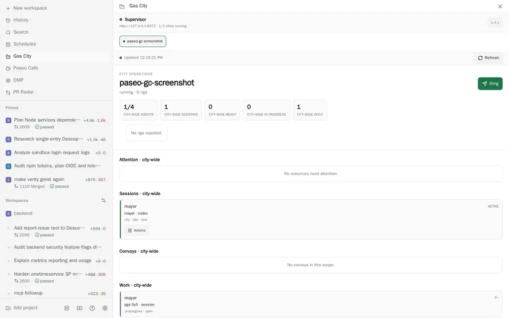
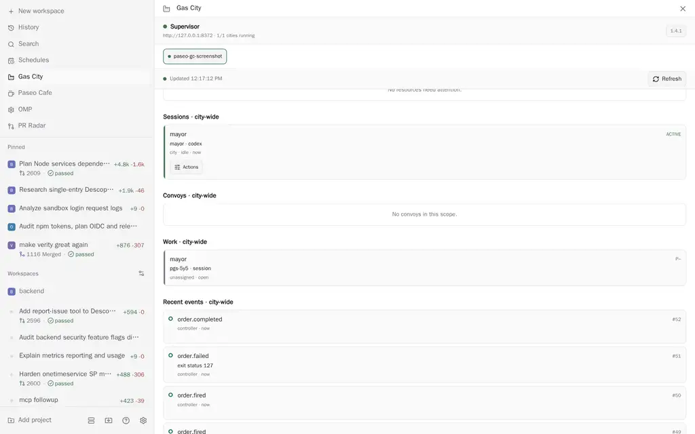
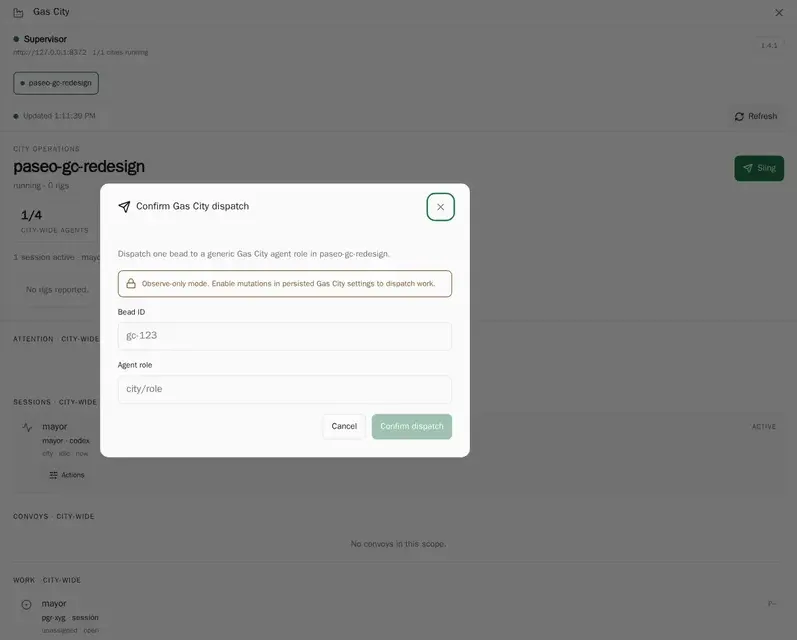
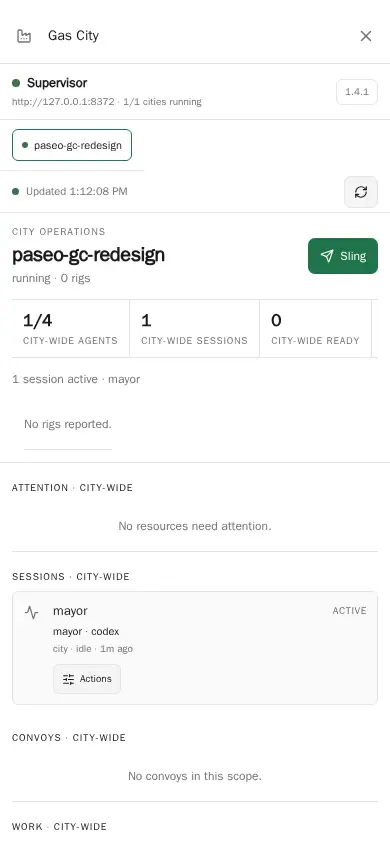

# Paseo Gas City

A Paseo control plane for observing and operating Gas City supervisors. It adds a global Gas City
surface and a workspace-scoped Factory panel.

## Screenshots

These screenshots use a temporary local Gas City v1.4.1 fixture. They contain no private project
or session data.

### Wide overview



### Work and event feed



### Guarded dispatch



### Compact layout



## What it does

- Discovers the configured supervisor and shows its cities, health, version, and diagnostics.
- Shows city-wide status and recent events, plus rig-filtered sessions and work. Convoys without
  upstream rig attribution remain visible in mapped workspace views.
- Maps a Paseo workspace to a Gas City rig by explicit override or longest ancestor path.
- Provides **Open Gas City**, **Configure Gas City**, and workspace **Open Gas City Factory** commands.
- Provides `/sling <bead-id> [agent-role]` to prefill a confirmed dispatch from a workspace.
- When mutations are enabled, supports confirmed bead dispatch plus wake, message, submit, stop,
  suspend, close, and kill session actions.

## Safety defaults

The default endpoint is `http://127.0.0.1:8372`. Non-loopback endpoints are rejected unless **Allow
remote endpoint** is enabled. Mutations are disabled by default, and mutation RPCs require explicit
confirmation even after they are enabled. These controls are an interactive safety interlock, not
an authorization boundary; Gas City remains responsible for access control. Responses, lists, and
strings are bounded and validated before they reach the UI.

Paseo plugins are trusted, unsandboxed code. Review the source before installing it on the daemon
host. Enabling a remote endpoint sends requests to that host from the Paseo daemon.

## Requirements and limitations

- Paseo `^0.8.0` with plugins enabled.
- A reachable Gas City v1.4.1 supervisor exposing its HTTP API.
- HTTP or HTTPS endpoints only. Credentials, query strings, and fragments are rejected.
- Automatic workspace mapping requires the workspace path to be inside exactly one discovered rig;
  ambiguous or unrelated paths need an explicit mapping.
- The dashboard polls at the configured interval. Supervisor events are a head snapshot, city event
  pages expose continuation cursors, and bounded or partial responses are marked truncated.
- **Open in Paseo is unavailable with Gas City v1.4.1.** `POST
  /v0/city/{cityName}/session/{id}/messages` returns a request ID and city event cursor, but
  `/v0/city/{cityName}/session/{id}/stream` emits transcript events with no request, message, or
  turn correlation ID. A provider would therefore be unable to assign a reply to a Paseo prompt
  safely when the session produces independent output.

## Install

From GitHub:

```bash
paseo plugin add omercnet/paseo-plugins:paseo-gas-city
```

From a local checkout on the Paseo daemon host:

```bash
git clone https://github.com/omercnet/paseo-plugins.git
cd paseo-plugins/paseo-gas-city
bun install --frozen-lockfile
paseo plugin install "$PWD"
```

Open **Gas City** from the sidebar or Command Center. Configure the supervisor endpoint and optional
workspace mappings under **Gas City settings**. In a workspace, open the **Factory** panel for the
mapped rig.

## Develop

```bash
bun install
bun run check
bun run typecheck
bun test
bun run test:coverage
bun run verify:package
```

The package is `@omercnet/paseo-gas-city` at version `0.0.1`. Release Please maintains versions,
changelog entries, component tags, and GitHub releases from Conventional Commits in the monorepo.
