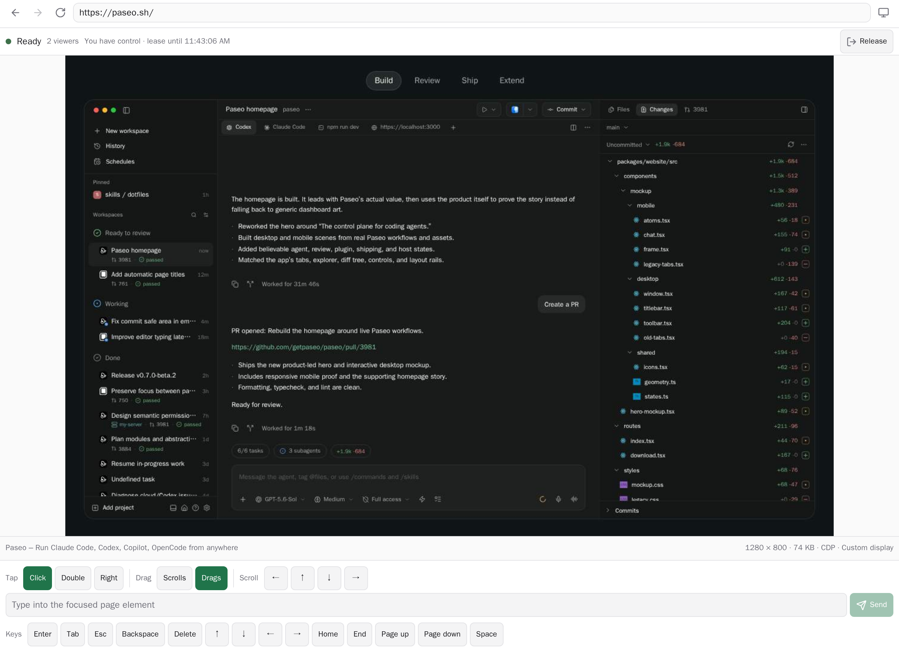

# Shared Browser

A Paseo plugin that runs one real Chromium browser per workspace on the daemon host and shares that
exact live session with every connected Paseo client. Version 1.0 replaces the previous browser
runtime in place with a plugin-owned, pinned `agent-browser` runtime; existing installations keep
the `shared-browser` plugin ID and upgrade without installing a second plugin.

This is not URL synchronization and not a second browser with copied cookies. Every viewer and
eligible workspace agent acts on the same running page, DOM, navigation state, and login state.
Many viewers can watch; human control remains server-authoritative and takes priority over agent
input.

## Screenshots

### Wide desktop



### Compact client


## Runtime model

- The plugin server runs beside the Paseo daemon and starts one `agent-browser` session and Chromium
  process per open browser workspace. Browser execution, profiles, IPC, and network access are on the
  daemon host, not on the viewing phone, browser, or desktop app.
- The plugin owns `agent-browser` version `0.37.1`, its IPC directory, and the Chromium executable.
  It strips inherited `AGENT_BROWSER_*` variables and sets `AGENT_BROWSER_SOCKET_DIR`,
  `AGENT_BROWSER_IDLE_TIMEOUT_MS=0`, `AGENT_BROWSER_STREAM_PORT=0`, and
  `AGENT_BROWSER_NO_AUTO_DIALOG=1` itself.
- Frames stream from Chromium through CDP `Page.startScreencast`, with a bounded screenshot fallback.
  Remote input supports tap, double-tap, right-click, drag, swipe scrolling, text, and special keys.
- Device presets for Desktop Chrome, iPhone 15 Pro, Pixel 7, and iPad Pro 11 change Chromium's
  viewport, device pixel ratio, touch behavior, platform, and user agent. A phone can view and
  control the shared browser, but the rendered browser remains Chromium. An iPhone preset is mobile
  emulation, not WebKit, iOS, or real Safari.

## Lifetime and persistence

The browser runtime is held by a detached supervisor rather than by a particular Paseo client or
plugin subprocess. Closing a panel, disconnecting a client, or losing the plugin bridge invalidates
that client's viewer/control tokens but does not immediately close Chromium. A replacement plugin
bridge can reclaim the existing workspace runtime. If no bridge reconnects, the supervisor closes
all orphaned runtimes after a 120-second grace period. A missed heartbeat fences the old bridge after
30 seconds; the bridge sends heartbeats every 10 seconds.

Each workspace gets a private profile under
`$PASEO_HOME/plugin-data/shared-browser/profiles/<workspace-id-sha256>`. Cookies and site login state
therefore survive viewer disconnects, plugin reloads, and Chromium process restarts while that
directory remains intact. Profiles are local to one daemon host: they are not synchronized between
hosts or Paseo clients, do not use a personal Chrome or Safari profile, and are not portable across
arbitrary Chromium versions.

When Paseo emits `workspace.archived` while the plugin server is active, the plugin fences that
workspace, expires its viewers and controller, and closes its browser runtime, including a runtime
whose creation raced the archive. The profile directory is retained. Archive events missed while
the plugin bridge is disconnected are not replayed or reconciled by the plugin; the orphan grace
still closes the runtime, but retained profile data must be removed manually if it is no longer
wanted.

## Install

Enable trusted plugins on the target Paseo daemon, then install from Git:

```bash
paseo plugin add omercnet/paseo-plugins:paseo-shared-browser
paseo plugin ls
```

Git installation runs `npm ci --include=dev` and `npm run prepare:runtime` on the daemon host. The
preparation step installs the pinned browser runtime and builds both `supervisor.cjs` and
`shared-browser-mcp.cjs` under
`$PASEO_HOME/plugin-data/shared-browser/runtime`. For a local monorepo checkout:

```bash
cd paseo-plugins/paseo-shared-browser
npm ci --include=dev
npm run prepare:runtime
paseo plugin install "$PWD"
```

The build requires Node.js 24 or newer and npm on the daemon host. The runtime also needs a
Chromium-compatible executable. Linux ARM64 requires a native ARM64 Chromium installation because
the bundled download is not available for that target; set
`PASEO_SHARED_BROWSER_CHROMIUM_EXECUTABLE` to its absolute executable path before installing or
starting the plugin. The plugin does not emulate x64 Chromium.

Open a workspace, search the Command Center for **Open Shared Browser**, or tap the **Shared
Browser** composer pill while a workspace session is open.

## Agent MCP access

The plugin automatically injects its stdio MCP adapter only when a new, non-internal agent is
created with a provider that accepts external MCP servers. Agents that already exist, resumed
sessions, imported sessions, and Paseo's internal agents are not modified. Paseo's OMP provider
uses native host-tool injection and rejects external MCP servers, so OMP agents are left unchanged.
Pi agents continue to receive the adapter, but they require Pi's optional MCP support to launch it.

The injected MCP server exposes exactly these tools: `shared_browser_status`,
`shared_browser_capture`, `shared_browser_acquire_control`, `shared_browser_release_control`,
`shared_browser_navigate`, `shared_browser_input`, and `shared_browser_viewport`. It does not
expose arbitrary CDP commands, JavaScript or page evaluation, browser profile access, or filesystem
access.

Each adapter launch receives an opaque credential bound to its workspace. It cannot use that
credential to operate another workspace's browser. Agent input follows human-priority control: an
agent cannot force a takeover while a human viewer holds control. The human must release control or
the lease must expire before agent input can proceed.

The provider launches the stdio adapter on the Paseo daemon host, beside the daemon-owned browser
runtime. Web, desktop, and mobile clients never own or host the adapter or Chromium, and a client
disconnect does not close or reset either process.

## Runtime environment overrides

The plugin recognizes only these deployment overrides:

| Variable                                    | Meaning                                                                                                                                                                                            |
| ------------------------------------------- | -------------------------------------------------------------------------------------------------------------------------------------------------------------------------------------------------- |
| `PASEO_HOME`                                | Paseo data root. Defaults to `~/.paseo`; browser runtime, supervisor IPC, and profiles live below `plugin-data/shared-browser`.                                                                    |
| `PASEO_SHARED_BROWSER_AGENT_BROWSER_BINARY` | Absolute path to the pinned `agent-browser` executable. Defaults to `$PASEO_HOME/plugin-data/shared-browser/runtime/node_modules/.bin/agent-browser`.                                              |
| `PASEO_SHARED_BROWSER_CHROMIUM_EXECUTABLE`  | Absolute path to Chromium. Defaults to `$PASEO_HOME/plugin-data/shared-browser/runtime/chromium/chrome`. Required for Linux ARM64 unless that default path is populated with a native ARM64 build. |

User-supplied `AGENT_BROWSER_*` variables are deliberately ignored.

## Controls

- Toolbar: back, forward, reload, address bar, and device emulation.
- Status row: session state, viewer count, controller, and lease expiry.
- Human control: **Take control**, **Release**, and **Take over** for explicit handoff. Agent MCP
  calls have no forced-takeover operation.
- Mobile: swipe scrolls by default; pointer and keyboard options open as bottom sheets.

## Security boundary

- Paseo plugins are trusted, unsandboxed code. The plugin server, detached supervisor,
  `agent-browser`, and Chromium execute as the daemon OS user and can reach that user's files,
  processes, credentials, and network.
- Supervisor IPC uses a user-private Unix socket and token files with owner-only permissions.
  `agent-browser` IPC metadata and workspace profile directories are also owner-only. The plugin
  rejects a non-loopback CDP endpoint and disables the `agent-browser` stream port.
- Viewer and control tokens coordinate clients already paired to the same Paseo daemon. Paseo v0.8
  plugin RPC callbacks expose no authenticated caller identity, so these human-viewer tokens are a
  workflow safeguard, not an authorization boundary. The stdio MCP adapter separately uses an
  opaque, workspace-bound credential.
- Downloads, uploads, clipboard synchronization, media permissions, extensions, native passkeys,
  and platform authenticators are not exposed by this plugin.
- Browser navigation uses the daemon OS user's network access, including local development servers.
  It is therefore a trusted-agent capability; this plugin deliberately does not apply a blanket
  loopback or RFC1918 navigation ban.

## Develop

```bash
npm ci
npm run typecheck
npm run lint
npm run format:check
npm run test:unit
npm run prepare:runtime
paseo plugin install "$PWD"
paseo plugin reload shared-browser
```

`bun run test:smoke` launches the configured real Chromium runtime and exercises two viewers,
control handoff, reconnect, stale-frame rejection, viewport changes, device emulation, profile
persistence, and archive teardown.

Release Please maintains the version, changelog, component tag, and GitHub release from
Conventional Commits in the monorepo.

Both the Paseo daemon and app must satisfy `^0.8.0`, including Paseo 0.8 prereleases. The client
surface uses React Native primitives and works in desktop, web, iOS, and Android Paseo clients.
