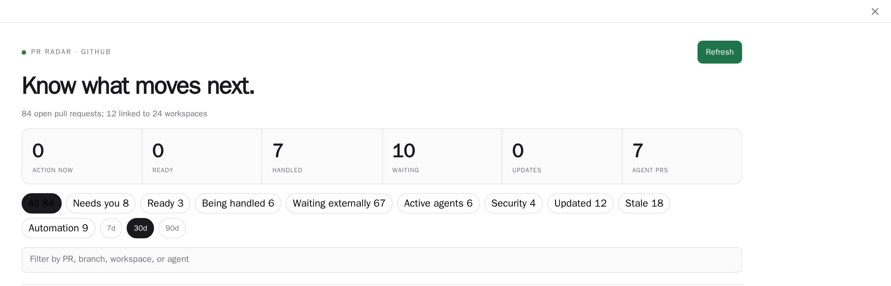
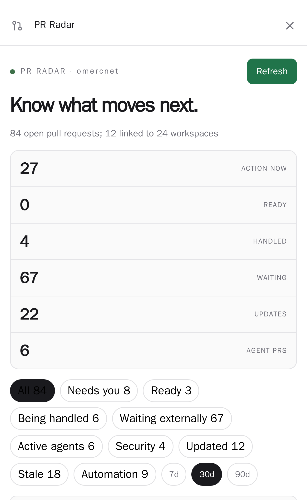

# PR Radar

A Paseo plugin that turns pull requests linked to active workspaces into a viewer-aware delivery queue.

PR Radar combines Paseo workspace and agent state with pull request checks, review status, mergeability, and the current GitHub user's relationship to each pull request. It answers which deliverables need you, which are already being handled, and which are waiting elsewhere.

## Screenshots

Repository, pull request, workspace, and agent names in these screenshots are synthetic. The live
browser DOM was rewritten before capture so no private identifiers are published.

### Wide dashboard



### Compact dashboard



## What it shows

- Needs you: authored blockers and review requests whose checks have completed.
- Being handled: actionable work with an active Paseo agent.
- Waiting externally: running checks, pending reviews, repository requirements, and external-author work.
- Ready: authored pull requests that are mergeable with settled checks and reviews.
- Viewer labels: `YOURS`, `REVIEW`, and `EXTERNAL`.
- Contextual actions: ask an existing agent or start one in the linked workspace.

Paseo supplies normalized workspace pull request status. A daemon-side plugin handler uses the authenticated `gh` CLI to distinguish authored pull requests from review requests. If viewer lookup fails, PR Radar falls back conservatively and does not claim that a row needs the user.

## Install

### Paseo 0.9 beta

Paseo 0.9 supports npm plugin sources. Install the published package on the daemon host:

```bash
paseo plugin install npm:@omercnet/paseo-pr-radar
```

Update an npm installation to the latest published release:

```bash
paseo plugin update pr-radar
```

The npm install and update flow requires Paseo 0.9. Paseo 0.8 does not accept npm plugin sources.

### Paseo 0.8

Install from the Git monorepo:

```bash
paseo plugin add omercnet/paseo-plugins:pr-radar
```

Or install a local checkout by absolute path on the daemon host:

```bash
paseo plugin install /absolute/path/to/paseo-plugins/pr-radar
```

On Paseo 0.8, `plugin update` updates Git-managed installations only. Local directory
installations continue to use their checked-out source and require `plugin reload` after edits.

The daemon must have plugins enabled and `gh` authenticated for GitHub viewer-aware triage.

## Develop

```bash
npm ci
npm run check
npm test
npm run test:coverage
npm run typecheck
npx paseo plugin install "$PWD"
npx paseo plugin reload pr-radar
```

Release Please maintains the version, changelog, component tag, and GitHub release from
Conventional Commits in the monorepo.

The manifest supports Paseo `0.8.x`, including compatible `0.8` prereleases, and Paseo
`0.9.0-beta.1`. Development uses the `0.9.0-beta.1` CLI, client, plugin SDK, and protocol packages
together while preserving runtime compatibility with 0.8 hosts. Host-owned navigation opens
linked agents and workspaces without private routes or page reloads on web, desktop, iOS, and
Android. React `19.1` and React Native `0.81` match the versions supplied by the plugin host.
